## EMPLOYEES

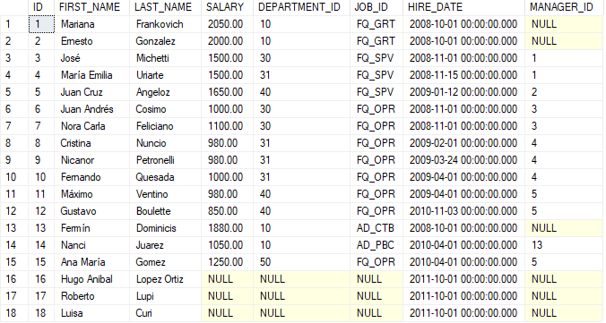

## DEPARTMENTS

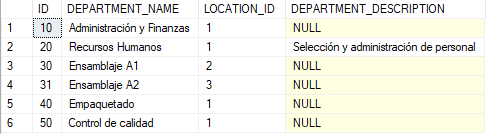

## JOBS

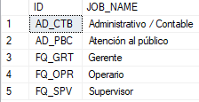

## LOCATIONS

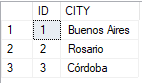

## 1)

```sql
SELECT *
FROM test.employees
```


## 2)

```sql
SELECT emp.id, emp.last_name, emp.hire_date
FROM test.employees emp
```

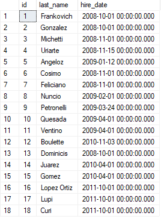

## 3)

```sql
SELECT emp.id, emp.last_name, emp.hire_date, ISNULL(emp.salary, 0) salary
FROM test.employees emp
```

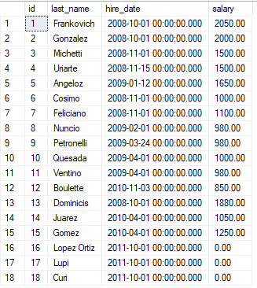

## 4)

```sql
SELECT emp.id, emp.last_name, emp.hire_date, ISNULL(emp.salary * 12, 0) annual_salary
FROM test.employees emp
```

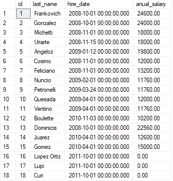

## 5)

```sql
SELECT emp.id, emp.first_name + '||' + emp.last_name fullname, emp.hire_date, ISNULL(emp.salary * 12, 0) annual_salary
FROM test.employees emp
```

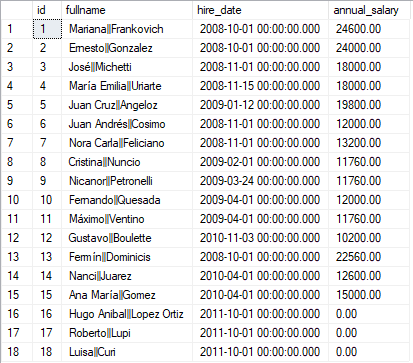

## 6a)

```sql
SELECT dep.id, department_name
FROM test.employees emp
INNER JOIN test.departments dep ON emp.department_id = dep.id
```

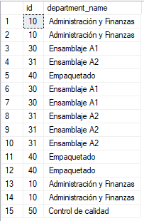

## 6b)

```sql
SELECT DISTINCT dep.id, department_name
FROM test.employees emp
INNER JOIN test.departments dep ON emp.department_id = dep.id
```

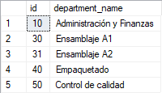

## 7)

```sql
SELECT *
FROM test.employees emp
WHERE emp.department_id = 10
```

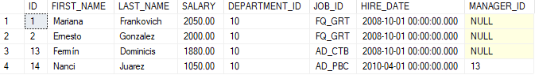

## 8)

```sql
SELECT *
FROM test.employees emp
WHERE emp.salary < 2000
```

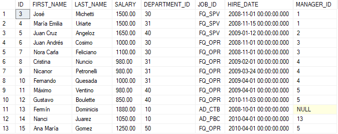

## 9)

```sql
SELECT *
FROM test.employees emp
WHERE emp.salary BETWEEN 1800 AND 3000
```

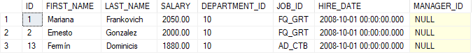

## 10)

```sql
SELECT *
FROM test.employees emp
WHERE emp.department_id IN(10,30,31)
```

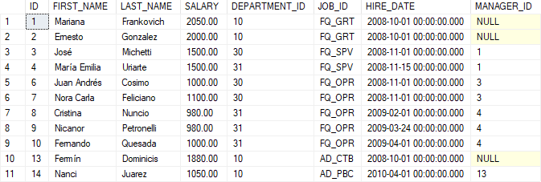

## 11)

```sql
SELECT *
FROM test.employees emp
WHERE emp.last_name LIKE('f%')
```

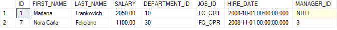

## 12a)

```sql
SELECT *
FROM test.employees emp
WHERE emp.job_id IS NULL
```


## 12b)

```sql
SELECT *
FROM test.employees emp
WHERE emp.job_id IS NOT NULL
```

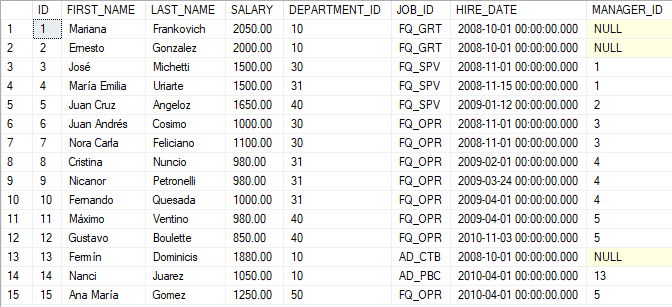

## 13)

```sql
SELECT *
FROM test.employees emp
WHERE emp.job_id <> 'AD_CTB'
```

> **Aclaración:** Los NULL no pasan la condición del WHERE
> 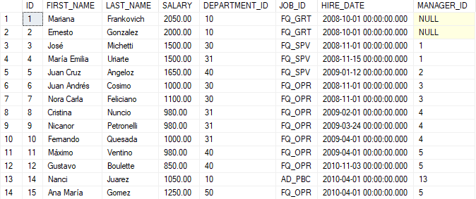

## 14)

```sql
SELECT *
FROM test.employees emp
WHERE emp.job_id <> 'AD_CTB' AND emp.salary > 1900
```


## 15)

```sql
SELECT *
FROM test.employees emp
WHERE emp.job_id <> 'AD_CTB' OR emp.salary > 1900
```

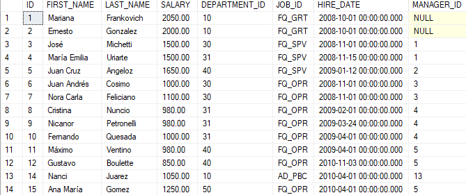

## 16)

```sql
SELECT *
FROM test.employees emp
WHERE (emp.job_id = 'AD_CTB' OR emp.job_id = 'FQ_GRT') AND emp.salary > 1900
```

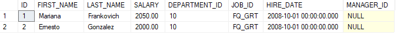

## 17)

```sql
SELECT *
FROM test.employees emp
ORDER BY emp.hire_date
```

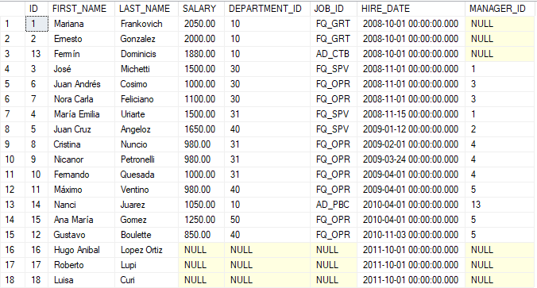

## 18)

```sql
SELECT *
FROM test.employees emp
ORDER BY emp.hire_date DESC
```

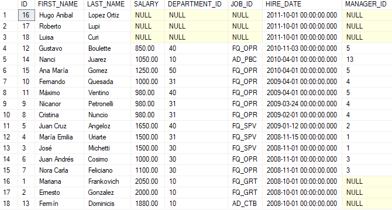

## 19)

```sql
SELECT *
FROM test.employees emp
ORDER BY emp.hire_date DESC, emp.last_name
```

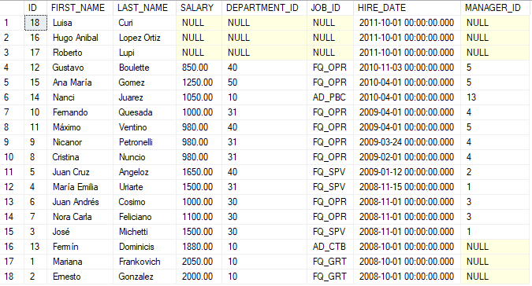

## 20)

```sql
SELECT emp.last_name, (emp.salary * 12) annual_salary
FROM test.employees emp
ORDER BY annual_salary DESC
```

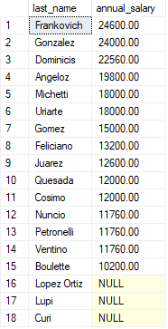

## 21)

```sql
SELECT *
FROM test.employees emp , test.departments dep
WHERE emp.department_id = dep.id
```


## 22)

```sql
SELECT emp.last_name, dep.department_name
FROM test.employees emp
LEFT JOIN test.departments dep ON emp.department_id = dep.id
```

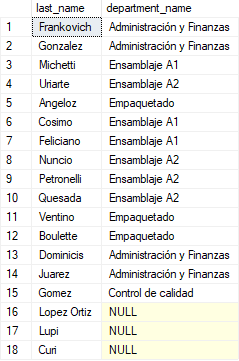

## 23)

```sql
SELECT emp.id id_emp, emp.last_name, dep.id id_dep, dep.department_name
FROM test.employees emp
LEFT JOIN test.departments dep ON emp.department_id = dep.id
```

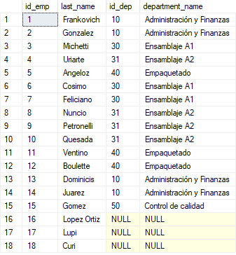

## 24)

```sql
SELECT emp.id id_emp, emp.last_name, dep.id id_dep, dep.department_name, dep.department_description, loc.city
FROM test.employees emp
LEFT JOIN test.departments dep ON emp.department_id = dep.id
LEFT JOIN test.locations loc ON dep.location_id = loc.id
```

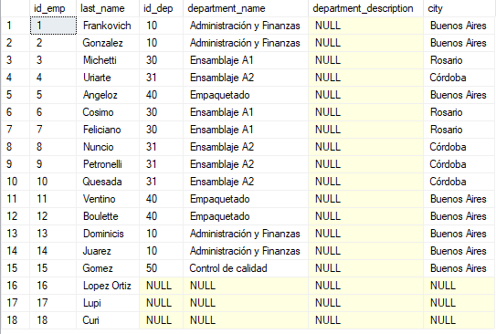

## 25)

```sql
SELECT *
FROM test.employees emp
JOIN test.departments dep ON emp.department_id = dep.id
```

> **Aclaración:** Se obtiene el mismo resultado que el ejercicio 21. También se puede utilizar el INNER JOIN.
> 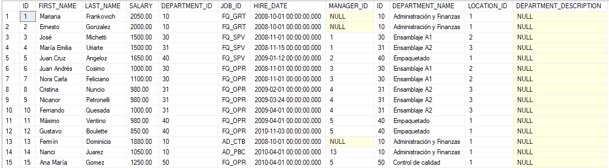

## 26)

```sql
SELECT *
FROM test.employees emp
LEFT JOIN test.departments dep ON emp.department_id = dep.id
```

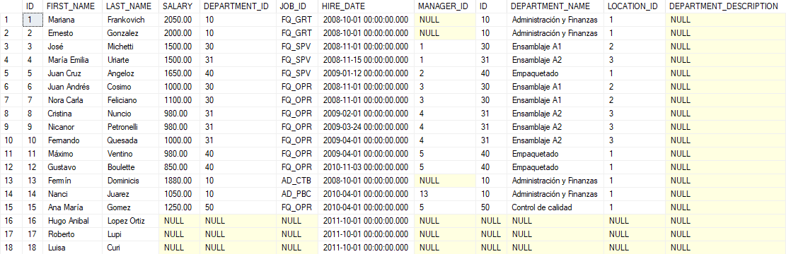

## 27)

```sql
SELECT *
FROM test.departments dep
LEFT JOIN test.employees emp ON dep.id = emp.department_id
```

> **Aclaración:** Se puede utilizar también el RIGHT JOIN invirtiendo las tablas.
> 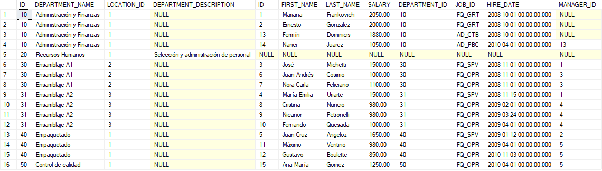

## 28)

```sql
SELECT man.id id_man, (man.first_name + ' ' + man.last_name) full_name_man, emp.id id_emp, (emp.first_name + ' ' + emp.last_name) full_name_emp
FROM test.employees man
INNER JOIN test.employees emp ON man.id = emp.manager_id
```

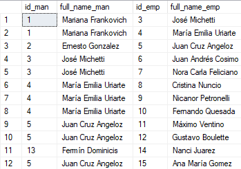

## 29)

```sql
SELECT MAX(emp.salary) max_salary
FROM test.employees emp
```

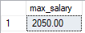

## 30)

```sql
SELECT MAX(emp.salary) max_salary, MIN(emp.salary) min_salary, AVG(emp.salary) promedy_salary, SUM(emp.salary) total_salary
FROM test.employees emp
```


## 31)

> WRONG !!!

```sql
SELECT MAX(emp.hire_date) max_hire_date, MIN(emp.hire_date) min_hire_date, AVG(emp.hire_date) promedy_hire_date, SUM(emp.hire_date) total_hire_date
FROM test.employees emp
```

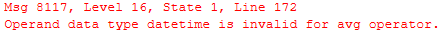
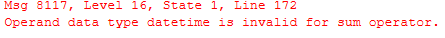

> GOOD !!!

```sql
SELECT MAX(emp.hire_date) max_hire_date, MIN(emp.hire_date) min_hire_date, AVG(emp.salary) promedy_salary, SUM(emp.salary) total_salary
FROM test.employees emp
```

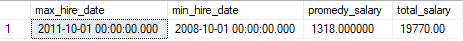

## 32)

```sql
SELECT COUNT(*) total_employees
FROM test.employees emp
```

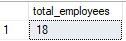

## 33)

```sql
SELECT COUNT(*) total_employees_dep_10
FROM test.employees emp
WHERE emp.department_id = 10
```

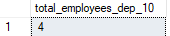

## 34)

```sql
SELECT dep.id id_dep, dep.department_name, COUNT(*) total_employees
FROM test.departments dep
INNER JOIN test.employees emp ON dep.id = emp.department_id
GROUP BY dep.id, dep.department_name
```

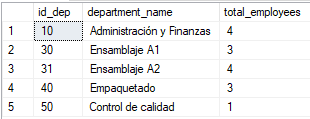

## 35)

```sql
SELECT dep.id id_dep, dep.department_name, job.id id_job, job.job_name, COUNT(*) total_employees
FROM test.departments dep
INNER JOIN test.employees emp ON dep.id = emp.department_id
INNER JOIN test.jobs job ON emp.job_id = job.id
GROUP BY dep.id, dep.department_name,job.id, job.job_name
```

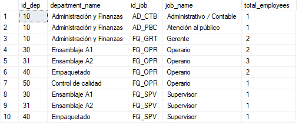
