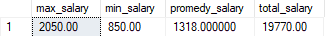

# Práctica Sql Server

## Ejercicios:

-   [1](#1)
-   [2](#2)
-   [3](#3)
-   [4](#4)
-   [5](#5)
-   6
    -   [a](#6a)
    -   [b](#6b)
-   [7](#7)
-   [8](#8)
-   [9](#9)
-   [10](#10)
-   [11](#11)
-   12
    -   [a](#12a)
    -   [a](#12b)
-   [13](#13)
-   [14](#14)
-   [15](#15)
-   [16](#16)
-   [17](#17)
-   [18](#18)
-   [19](#19)
-   [20](#20)
-   [21](#21)
-   [22](#22)
-   [23](#23)
-   [24](#24)
-   [25](#25)
-   [26](#26)
-   [27](#27)
-   [28](#28)
-   [29](#29)
-   [30](#30)
-   [31](#31)
-   [32](#32)
-   [33](#33)
-   [34](#34)
-   [35](#35)
-   [36](#36)
-   [37](#37)

## EMPLOYEES


## DEPARTMENTS


## JOBS


## LOCATIONS


<div id="1"/>

## 1)

```sql
SELECT *
FROM test.employees
```


<div id="2"/>

## 2)

```sql
SELECT emp.id, emp.last_name, emp.hire_date
FROM test.employees emp
```


<div id="3"/>

## 3)

```sql
SELECT emp.id, emp.last_name, emp.hire_date, ISNULL(emp.salary, 0) salary
FROM test.employees emp
```


<div id="4"/>

## 4)

```sql
SELECT emp.id, emp.last_name, emp.hire_date, ISNULL(emp.salary * 12, 0) annual_salary
FROM test.employees emp
```


<div id="5"/>

## 5)

```sql
SELECT emp.id, emp.first_name + '||' + emp.last_name fullname, emp.hire_date, ISNULL(emp.salary * 12, 0) annual_salary
FROM test.employees emp
```


<div id="6a"/>

## 6a)

```sql
SELECT dep.id, department_name
FROM test.employees emp
INNER JOIN test.departments dep ON emp.department_id = dep.id
```


<div id="6b"/>

## 6b)

```sql
SELECT DISTINCT dep.id, department_name
FROM test.employees emp
INNER JOIN test.departments dep ON emp.department_id = dep.id
```


<div id="7"/>

## 7)

```sql
SELECT *
FROM test.employees emp
WHERE emp.department_id = 10
```


<div id="8"/>

## 8)

```sql
SELECT *
FROM test.employees emp
WHERE emp.salary < 2000
```


<div id="9"/>

## 9)

```sql
SELECT *
FROM test.employees emp
WHERE emp.salary BETWEEN 1800 AND 3000
```


<div id="10"/>

## 10)

```sql
SELECT *
FROM test.employees emp
WHERE emp.department_id IN(10,30,31)
```


<div id="11"/>

## 11)

```sql
SELECT *
FROM test.employees emp
WHERE emp.last_name LIKE('f%')
```


<div id="12a"/>

## 12a)

```sql
SELECT *
FROM test.employees emp
WHERE emp.job_id IS NULL
```


<div id="12b"/>

## 12b)

```sql
SELECT *
FROM test.employees emp
WHERE emp.job_id IS NOT NULL
```


<div id="13"/>

## 13)

```sql
SELECT *
FROM test.employees emp
WHERE emp.job_id <> 'AD_CTB'
```

> **Aclaración:** Los NULL no pasan la condición del WHERE
> 

<div id="14"/>

## 14)

```sql
SELECT *
FROM test.employees emp
WHERE emp.job_id <> 'AD_CTB' AND emp.salary > 1900
```


<div id="15"/>

## 15)

```sql
SELECT *
FROM test.employees emp
WHERE emp.job_id <> 'AD_CTB' OR emp.salary > 1900
```


<div id="16"/>

## 16)

```sql
SELECT *
FROM test.employees emp
WHERE (emp.job_id = 'AD_CTB' OR emp.job_id = 'FQ_GRT') AND emp.salary > 1900
```


<div id="17"/>

## 17)

```sql
SELECT *
FROM test.employees emp
ORDER BY emp.hire_date
```


<div id="18"/>

## 18)

```sql
SELECT *
FROM test.employees emp
ORDER BY emp.hire_date DESC
```


<div id="19"/>

## 19)

```sql
SELECT *
FROM test.employees emp
ORDER BY emp.hire_date DESC, emp.last_name
```


<div id="20"/>

## 20)

```sql
SELECT emp.last_name, (emp.salary * 12) annual_salary
FROM test.employees emp
ORDER BY annual_salary DESC
```


<div id="21"/>

## 21)

```sql
SELECT *
FROM test.employees emp , test.departments dep
WHERE emp.department_id = dep.id
```


<div id="22"/>

## 22)

```sql
SELECT emp.last_name, dep.department_name
FROM test.employees emp
LEFT JOIN test.departments dep ON emp.department_id = dep.id
```


<div id="23"/>

## 23)

```sql
SELECT emp.id id_emp, emp.last_name, dep.id id_dep, dep.department_name
FROM test.employees emp
LEFT JOIN test.departments dep ON emp.department_id = dep.id
```


<div id="24"/>

## 24)

```sql
SELECT emp.id id_emp, emp.last_name, dep.id id_dep, dep.department_name, dep.department_description, loc.city
FROM test.employees emp
LEFT JOIN test.departments dep ON emp.department_id = dep.id
LEFT JOIN test.locations loc ON dep.location_id = loc.id
```


<div id="25"/>

## 25)

```sql
SELECT *
FROM test.employees emp
JOIN test.departments dep ON emp.department_id = dep.id
```

> **Aclaración:** Se obtiene el mismo resultado que el ejercicio 21. También se puede utilizar el INNER JOIN.
> 

<div id="26"/>

## 26)

```sql
SELECT *
FROM test.employees emp
LEFT JOIN test.departments dep ON emp.department_id = dep.id
```


<div id="27"/>

## 27)

```sql
SELECT *
FROM test.departments dep
LEFT JOIN test.employees emp ON dep.id = emp.department_id
```

> **Aclaración:** Se puede utilizar también el RIGHT JOIN invirtiendo las tablas.
> 

<div id="28"/>

## 28)

```sql
SELECT man.id id_man, (man.first_name + ' ' + man.last_name) full_name_man, emp.id id_emp, (emp.first_name + ' ' + emp.last_name) full_name_emp
FROM test.employees man
INNER JOIN test.employees emp ON man.id = emp.manager_id
```


<div id="29"/>

## 29)

```sql
SELECT MAX(emp.salary) max_salary
FROM test.employees emp
```


<div id="30"/>

## 30)

```sql
SELECT MAX(emp.salary) max_salary, MIN(emp.salary) min_salary, AVG(emp.salary) promedy_salary, SUM(emp.salary) total_salary
FROM test.employees emp
```



<div id="31"/>

## 31)

> WRONG !!!

```sql
SELECT MAX(emp.hire_date) max_hire_date, MIN(emp.hire_date) min_hire_date, AVG(emp.hire_date) promedy_hire_date, SUM(emp.hire_date) total_hire_date
FROM test.employees emp
```


> GOOD !!!

```sql
SELECT MAX(emp.hire_date) max_hire_date, MIN(emp.hire_date) min_hire_date, AVG(emp.salary) promedy_salary, SUM(emp.salary) total_salary
FROM test.employees emp
```


<div id="32"/>

## 32)

```sql
SELECT COUNT(*) total_employees
FROM test.employees emp
```


<div id="33"/>

## 33)

```sql
SELECT COUNT(*) total_employees_dep_10
FROM test.employees emp
WHERE emp.department_id = 10
```


<div id="34"/>

## 34)

```sql
SELECT dep.id id_dep, dep.department_name, COUNT(*) total_employees
FROM test.departments dep
INNER JOIN test.employees emp ON dep.id = emp.department_id
GROUP BY dep.id, dep.department_name
```


<div id="35"/>

## 35)

```sql
SELECT dep.id id_dep, dep.department_name, job.id id_job, job.job_name, COUNT(*) total_employees
FROM test.departments dep
INNER JOIN test.employees emp ON dep.id = emp.department_id
INNER JOIN test.jobs job ON emp.job_id = job.id
GROUP BY dep.id, dep.department_name,job.id, job.job_name
```


<div id="36"/>

## 36)

```sql
SELECT emp.department_id, dep.department_name, AVG(emp.salary) promedy_salary
FROM test.employees emp
INNER JOIN test.departments dep ON emp.department_id = dep.id
GROUP BY emp.department_id, dep.department_name
```


<div id="37"/>

## 37)

```sql
SELECT emp.department_id, dep.department_name, AVG(emp.salary) promedy_salary
FROM test.employees emp
INNER JOIN test.departments dep ON emp.department_id = dep.id
GROUP BY emp.department_id, dep.department_name
HAVING AVG(emp.salary) < 1200
```


