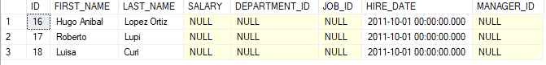

## EMPLOYEES


## DEPARTMENTS


## JOBS


## LOCATIONS


## 1)

```sql
SELECT *
FROM test.employees
```


## 2)

```sql
SELECT emp.id, emp.last_name, emp.hire_date
FROM test.employees emp
```


## 3)

```sql
SELECT emp.id, emp.last_name, emp.hire_date, ISNULL(emp.salary, 0) salary
FROM test.employees emp
```


## 4)

```sql
SELECT emp.id, emp.last_name, emp.hire_date, ISNULL(emp.salary * 12, 0) annual_salary
FROM test.employees emp
```


## 5)

```sql
SELECT emp.id, emp.first_name + '||' + emp.last_name fullname, emp.hire_date, ISNULL(emp.salary * 12, 0) annual_salary
FROM test.employees emp
```


## 6a)

```sql
SELECT dep.id, department_name
FROM test.employees emp
INNER JOIN test.departments dep ON emp.department_id = dep.id
```


## 6b)

```sql
SELECT DISTINCT dep.id, department_name
FROM test.employees emp
INNER JOIN test.departments dep ON emp.department_id = dep.id
```


## 7)

```sql
SELECT *
FROM test.employees emp
WHERE emp.department_id = 10
```


## 8)

```sql
SELECT *
FROM test.employees emp
WHERE emp.salary < 2000
```


## 9)

```sql
SELECT *
FROM test.employees emp
WHERE emp.salary BETWEEN 1800 AND 3000
```


## 10)

```sql
SELECT *
FROM test.employees emp
WHERE emp.department_id IN(10,30,31)
```


## 11)

```sql
SELECT *
FROM test.employees emp
WHERE emp.last_name LIKE('f%')
```


## 12a)

```sql
SELECT *
FROM test.employees emp
WHERE emp.job_id IS NULL
```



## 12b)

```sql
SELECT *
FROM test.employees emp
WHERE emp.job_id IS NOT NULL
```


## 13)

```sql
SELECT *
FROM test.employees emp
WHERE emp.job_id <> 'AD_CTB'
```

> **Aclaración:** Los NULL no pasan la condición del WHERE
> 

## 14)

```sql
SELECT *
FROM test.employees emp
WHERE emp.job_id <> 'AD_CTB' AND emp.salary > 1900
```


## 15)

```sql
SELECT *
FROM test.employees emp
WHERE emp.job_id <> 'AD_CTB' OR emp.salary > 1900
```


## 16)

```sql
SELECT *
FROM test.employees emp
WHERE (emp.job_id = 'AD_CTB' OR emp.job_id = 'FQ_GRT') AND emp.salary > 1900
```


## 17)

```sql
SELECT *
FROM test.employees emp
ORDER BY emp.hire_date
```


## 18)

```sql
SELECT *
FROM test.employees emp
ORDER BY emp.hire_date DESC
```


## 19)

```sql
SELECT *
FROM test.employees emp
ORDER BY emp.hire_date DESC, emp.last_name
```


## 20)

```sql
SELECT emp.last_name, (emp.salary * 12) annual_salary
FROM test.employees emp
ORDER BY annual_salary DESC
```


## 21)

```sql
SELECT emp.first_name, emp.last_name, dep.department_description
FROM test.employees emp
LEFT JOIN test.departments dep ON emp.department_id = dep.id
```


## 22)

```sql
SELECT emp.last_name, dep.department_name
FROM test.employees emp
LEFT JOIN test.departments dep ON emp.department_id = dep.id
```


## 23)

```sql
SELECT emp.id id_emp, emp.last_name, dep.id id_dep, dep.department_name
FROM test.employees emp
LEFT JOIN test.departments dep ON emp.department_id = dep.id
```


## 24)

```sql
SELECT emp.id id_emp, emp.last_name, dep.id id_dep, dep.department_name, dep.department_description, loc.city
FROM test.employees emp
LEFT JOIN test.departments dep ON emp.department_id = dep.id
LEFT JOIN test.locations loc ON dep.location_id = loc.id
```


